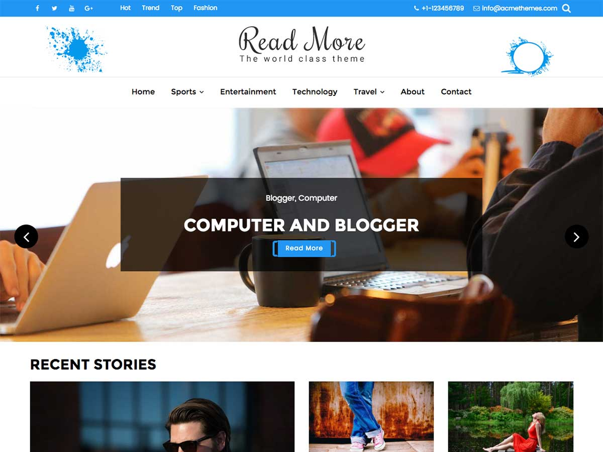

# Read More

**Contributors:** acmethemes  
**Requires at least:** 6.6  
**Tested up to:** 7.0  
**Requires PHP:** 7.4  
**Stable tag:** 4.0.0  
**License:** GPLv2 or later  
**License URI:** https://www.gnu.org/licenses/gpl-2.0.html  

> 

Read More is a blog-focused WordPress theme designed for writers who want their content to shine. From personal journals to professional journalism, it gives you a clean, distraction-free reading experience with thoughtful typography and a responsive layout that works perfectly on every device.

## Features

- **Clean reading experience** — typography-first design for long-form content
- **Featured section** — highlight your best or most recent posts
- **Custom header & background** — personalize your blog's look
- **Custom logo** — upload your brand or personal logo
- **Sidebar options** — left, right, or full-width for posts and pages
- **Author widget** — display author bio and social links
- **Social icons** — connect with your readers
- **Custom CSS** — style tweaks without a child theme
- **Breadcrumb navigation** — SEO-friendly site structure
- **Footer widgets** — links, categories, and tag clouds
- **WooCommerce compatible** — sell books, courses, or merchandise
- **Translation ready** — .pot file included
- **Responsive & SEO friendly** — rank well, read anywhere

## Installation

1. Download the theme zip file.
2. In your WordPress admin, go to **Appearance → Themes**.
3. Click **Add New** → **Upload Theme**.
4. Select the zip file and click **Install Now**.
5. Click **Activate**.

## Frequently Asked Questions

### How do I customize the theme?

Go to **Appearance → Customize** — you can adjust layout, colors, header, footer, and featured content from one screen.

### How do I set up the front page?

Create a new page in **Pages → Add New**, go to **Settings → Reading**, and set it as the static front page.

## Credits

Read More is built on [Underscores](https://underscores.me/) and licensed under GPLv2 or later. It bundles the following third-party resources:

- [Google Fonts](https://fonts.google.com/) — Apache License 2.0
- [Font Awesome](https://fontawesome.com/) — MIT / SIL OFL 1.1
- [normalize.css](https://necolas.github.io/normalize.css/) — MIT
- [BxSlider](https://bxslider.com/) — MIT
- [SlickNav](https://github.com/ComputerWolf/SlickNav) — MIT
- [Theia Sticky Sidebar](https://github.com/WeCodePixels/theia-sticky-sidebar) — MIT
- [Breadcrumb Trail](https://github.com/justintadlock/breadcrumb-trail) — GPLv2+
- [TGM Plugin Activation](http://tgmpluginactivation.com/) — GPLv2+
- [html5shiv](https://github.com/afarkas/html5shiv) — MIT
- [Respond.js](https://github.com/scottjehl/Respond) — MIT

---

[Demo](https://www.acmethemes.com/demo/?theme=read-more) &middot; [Support](https://www.acmethemes.com/supports/) &middot; [Acme Themes](https://www.acmethemes.com)
